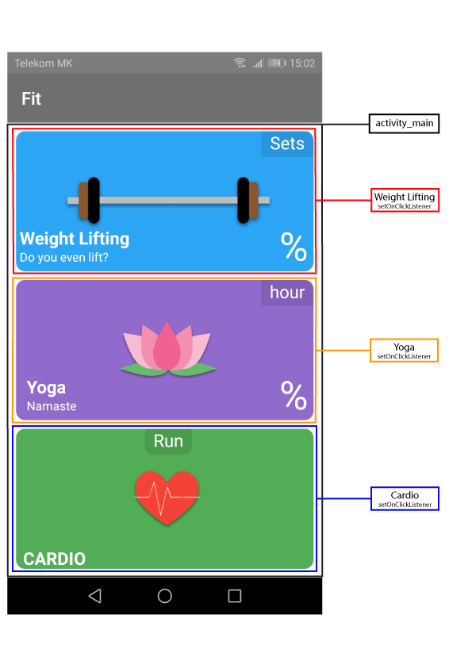
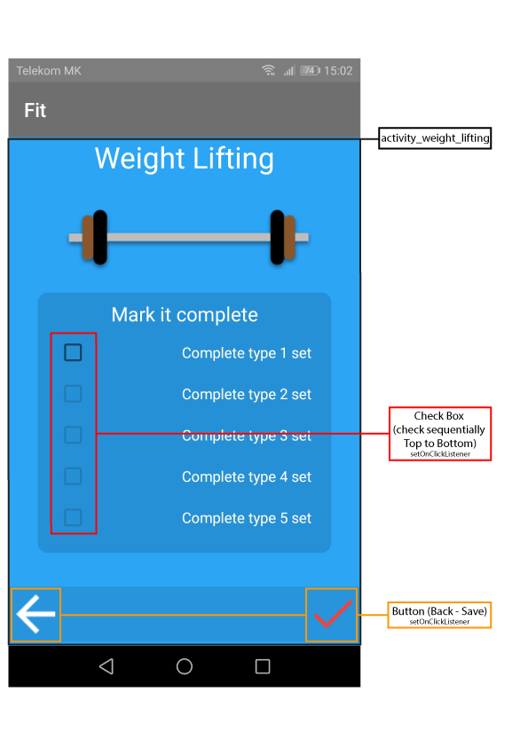
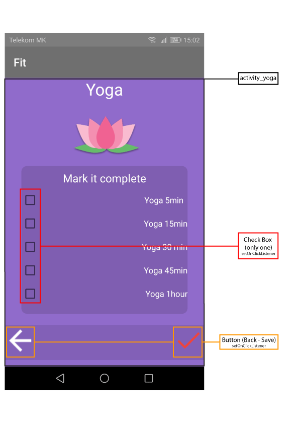
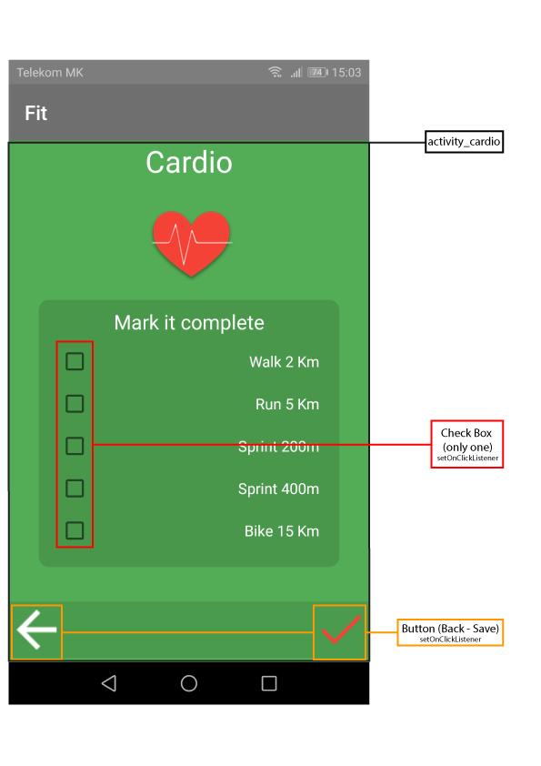

# Android_Fit
Different Activity with Check Box (Weight-Lifting, Yoga, Cardio)

## Description:    
      
  ### 1. Add AndroidManifest

	<application

		<!-- Intent WeightLifting Activity -->
	<activity android:name=".activity.WeightLiftingActivity" ></activity>

		<!-- Intent Yoga Activity -->
	<activity android:name=".activity.YogaActivity"></activity>

		<!-- Intent Cardio Activity -->
	<activity android:name=".activity.CardioActivity"></activity>
		
	</application>

  ### 2. Create                          

   **Package / Class:**

   - **activity (Package)**
      - WeightLiftingActivity.class
      - YogaActivity.class
      - CardioActivity.class

   - **singleton (Package)**
      - DetailsSingleton.class

   - MainActivity.class   
   
  **layout:**
   - activity_main.xml
   - activity_weight_lifting.xml
   - activity_yoga.xml
   - activity_cardio.xml   
 

  ### 3. ScreenShoot / Concept
  
   
  
      

### 4. Demo

   _____________________ 
  
   _____________________ 

## Author: Nikola Petkovik
  ### contact:
   - Gmail: nikolapetkovik86@gmail.com
   
